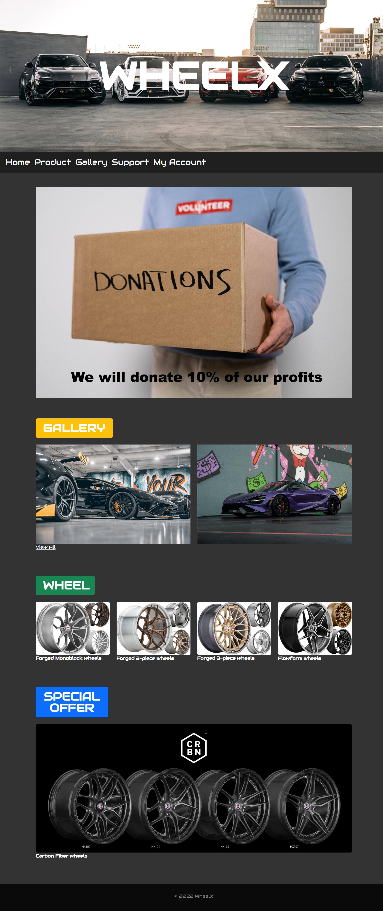

# **cola**

## **wheelx**

### **Team Overview**
- Name: Hongxi Huang 
- GitHub: xixicir

### **Application Idea** (*changed*)
*wheelx* is a web application I am planning to design for wheels' sales. There will be 4 types of data: parts' names, parts' prices, parts' sizes and users' accounts and passwords. The web application will be composed of 5 parts: homepage, product, gallery, support and my account. There are also some functions such as search, sort and filter in the web application.

### **Functionality** (*changed*)
On the *wheelx*, in order for customers to find their perfect wheels, they can use filters or select their needed sizes to narrow the available options. For the filter function, the parts' will be filtered based on their series. If the users select their needed sizes, the corresponding prices will be shown.

### **Screenshot of HTML Page**

**Description:** The content in the main page is a brief introduction of our website. Each title in the navigation bar lines to a specific subpage. All pages are basically functional except the account page. The *View All* under *GALLERY* content also links to the gallery page.

### **Link of the Video**
